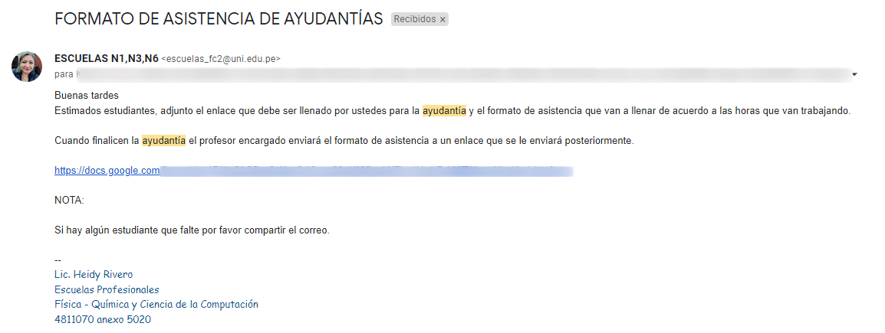

# Ayudantia Academica

Aunque esta figure como un curso en tu malla curricular, este curso se valida. Esto quiere decir que no figura en el proceso de matricula.

Entonces, desde que momento puedes empezar ya  a planear tu ayudantia academica?. 

Pues la respuesta mas adecuada es desde el final del ciclo anterior al que vas a realizar la ayudantia.

Por ejemplo si planeas hacer la ayudantia en el ciclo **2021-2**, te recomiendo ir planeándolo desde el final del ciclo **2021-1**.

Entonces que debes tener en cuenta:

- La mayoria de profesores tienen un solo ayudante en su curso, y si alguien ya le pidio hacer ayudantia con el, tu no tendras la posibilidad.
- Empieza buscando un curso donde te haya ido bien o que domines (por si el profesor te pide que dictes algunas clases o realices uno que otro trabajo).
- Dependiendo del profesor puede que te deje mas tarea o menos tarea como ayudante.

Cuando ya tengas claro a que profesor pedirle para realizar tu ayudantia, debes escribirle por correo uni o celular (de ser el caso) para que te permita realizar ayudantias con el.

El correo podria tener una estructura como:

- Asunto: AYUDANTIA ACADÉMICA

- Destino: correo_del_docente_uni@uni.pe 

- Mensaje:

  ```
  Estimado xxxxx yyyyy zzzzz,
  
  Le escribo porque estoy interesado en hacer ayudantía académica en su curso de xxxxxxxx xxxxxxx, ya que se adecua a mi horario y es un requisito que debo cumplir ya que me encuentro en los últimos ciclos, espero que pueda aceptarme la ayudantía, para poder enviarle la confirmación a la escuela de ciencia de la computación.
  
  Saludos cordiales,
  ```

Luego de recibir la confirmación de parte del profesor, escriba un correo a escuelas indicándole la informacion sobre su ayudantia.

El correo podria tener una estructura como

- Asunto: AYUDANTIA ACADÉMICA

- Destino: escuelas_fc2@uni.edu.pe

- Mensaje:

  ```
  Buenas noches,
  
  Soy xxxxx yyyyy zzzzz, alumno de ciencia de la computación, el día de hoy hablé con el profesor xxxxxx yyyyy zzzzzz, para solicitarle si podría realizar ayudantía académica en su curso, CCYYY XXXXX YYYYY.  Por lo que me dijo que, les solicite a ustedes que me registren como ayudante del curso. Y envíen el formato de firmas y los documentos necesarios para realizar la ayudantía.  
  
  Saludos cordiales,
  ```

Luego de unos dias de recibir la confirmacion por parte de escuelas deberias recibir un correo como el siguiente. Con un formulario de google que debes llenar y adjuntado el formato de ayudantia.



